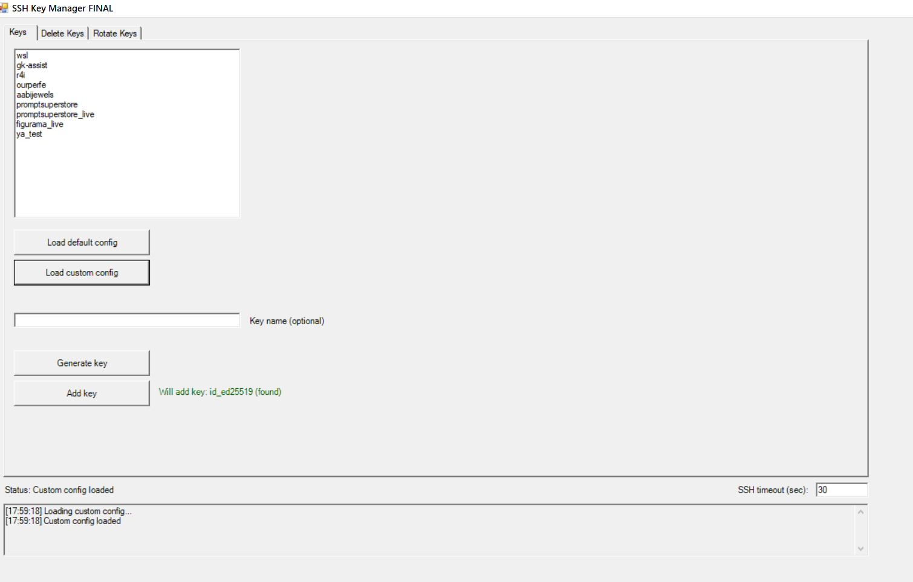
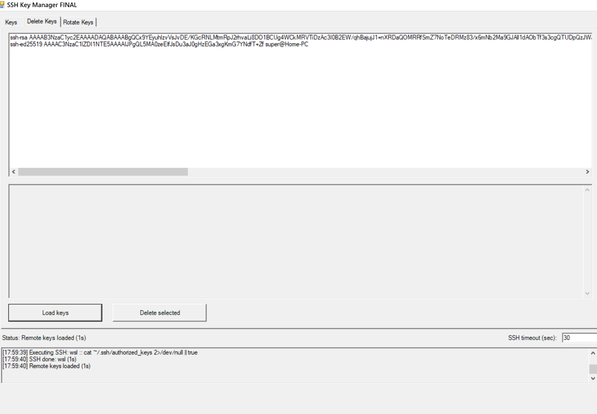

# SSH Key Manager

PowerShell WinForms tool for SSH key lifecycle operations:
- Generate key pairs
- Add keys to remote servers
- List and delete keys from `authorized_keys`
- Rotate keys across multiple servers

## Requirements

- Windows 10/11
- PowerShell 5.1+ (PowerShell 7 recommended)
- OpenSSH client installed (`ssh`, `ssh-keygen`)
- Access to target servers by SSH aliases from `~/.ssh/config`

## Run (recommended)

Use `run.bat` as the primary launcher (double-click it):
- `run.bat` starts PowerShell with `-NoProfile` and runs `ssh-manager.ps1`.
- This is the most stable runtime mode for this project.

Alternative terminal launch:

```powershell
powershell -NoProfile -ExecutionPolicy Bypass -File .\ssh-manager.ps1
```

## Build EXE (optional)

```powershell
Set-ExecutionPolicy -Scope Process Bypass
.\build-exe.ps1
```

## Notes

- App writes logs to `ssh-manager.log` in the same folder.
- SSH config is read-only; the tool does not edit SSH config files.
- Timeout can be configured in the app UI.

## Screenshots




